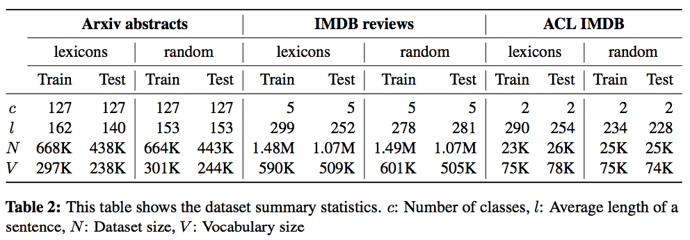

This repository contains the data and code of the paper: [**Investigating the Working of Text Classifiers, COLING 2018**](https://arxiv.org/abs/1801.06261)

## Datasets

* **ACL-IMDB**: This is a benchmark dataset ([Maas et al., 2011](http://ai.stanford.edu/~amaas/data/sentiment/)) of IMDB movie reviews for
**_coarse-grained sentiment analysis_** in which the task is to determine if a review belongs to the **_positive_**
 or to the **_negative_** class. The original random split version of this dataset contains an equal
number of positive and negative reviews. To construct its lexicon-based version, we
apply our approach to the combined training and test splits of this dataset. This dataset 
is included with this repo.

* **IMDB reviews**:  This is a much bigger version of the IMDB movie reviews dataset in which the
task is to do **_fine-grained sentiment analysis_**. We collect more than 2.5 million reviews from IMDB
website and partition them into five classes based on their ratings out of 10. These classes are
**_most-negative_**, **_negative_**, **_neutral_**, **_positive_**, and **_most-positive_**. This dataset can be obtained here:
[URL](https://drive.google.com/open?id=1BhEB7zLljQnQ4mABru9KFJtn-RtfFDxH)

* **Arxiv abstracts**: This is a new multiclass **_topic classification_** dataset. It was constructed 
by collecting more than 1 million abstracts of scientific papers from the website “*arxiv.org*”. Each paper has
one primary category such as *cs.AI*, *stat.ML*, etc. that we use as its class label. We selected those
primary categories that had at least 500 papers. To extract text data, we use the title and
abstract of each paper. This dataset can be obtained here: [URL](https://drive.google.com/open?id=1ucAmytLH6PkHRegoJ_Vo7El2NOEmNL61)

In both the Arxiv and IMDB dataset, the ratio of
the test set to that of training set as 0.6


#### Dataset Statistics



## Citation
If you find the data or code useful, please consider citing our paper as:
```
@InProceedings{sachan2018investigating,
  author = 	"Sachan, Devendra
		and Zaheer, Manzil
		and Salakhutdinov, Ruslan",
  title = 	"Investigating the Working of Text Classifiers",
  booktitle = 	"Proceedings of the 27th International Conference on Computational Linguistics",
  year = 	"2018",
  publisher = 	"Association for Computational Linguistics",
  pages = 	"2120--2131",
  location = 	"Santa Fe, New Mexico, USA",
  url = 	"http://aclweb.org/anthology/C18-1180"
}
```
